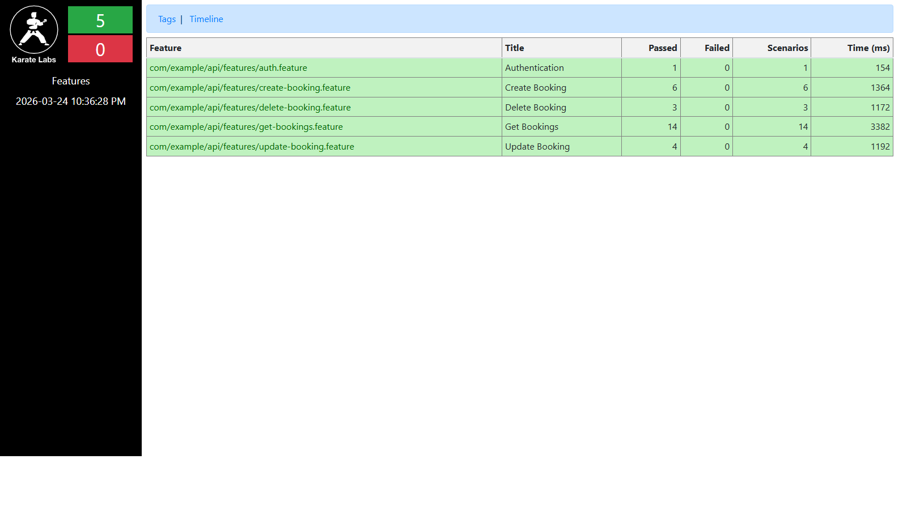
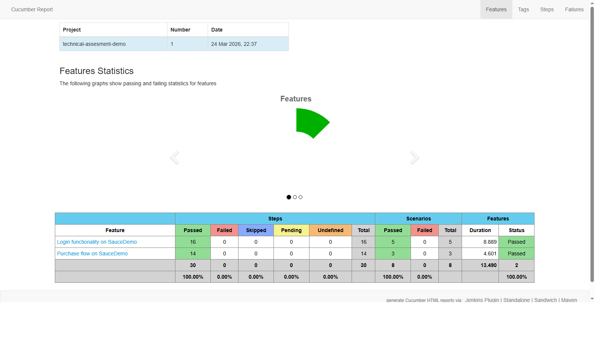

# Decision Log

## 1. Scope Interpretation and Timeboxing

The assessment asked for a small API suite and a short UI smoke flow, with an approximate 4-hour budget.

**Decisions made:**
- Covered all five CRUD-related endpoints on Restful Booker (auth, get, create, update, delete) rather than exactly 3, because the endpoints are small and logically connected — stopping at 3 would have left obvious coverage gaps.
- UI scope was kept to two flows: login variants and the full purchase journey. Additional flows (e.g., sorting, error recovery) were deprioritized as out of scope for a smoke suite.
- No CI/CD pipeline was wired up; that is called out in Next Steps below.

---

## 2. Test Selection and Coverage Rationale

### API Tests (Karate + JUnit 5)

| Endpoint | Positive | Unhappy Path | Boundary / Edge |
|----------|----------|-------------|-----------------|
| `POST /auth` | Valid credentials → token returned | — | — |
| `GET /booking` | All IDs returned, filter by name | Non-existent ID → 404 | Scenario Outline over first 10 IDs |
| `POST /booking` | Full payload → schema-validated response | Empty body → 500 | Optional field omitted |
| `PUT /booking/:id` | Full update persists all fields | No auth token → 403 | PATCH partial update retains unchanged fields |
| `DELETE /booking/:id` | Delete → 201, subsequent GET → 404 | No auth token → 403 | — |

Auth was tested positive-only because the assessment target returns an `"Invalid credentials"` string (HTTP 200) rather than a 4xx, making negative auth assertions fragile against a public demo API with no SLA.

### UI Tests (Selenium + Cucumber + TestNG)

- **login.feature** — valid login, locked-out user error, and a Scenario Outline covering invalid and empty credential combinations.
- **purchase_flow.feature** — single-item add, multi-item add, and the full checkout journey from inventory to order confirmation.

BDD/Gherkin was chosen for UI because it produces human-readable living documentation and aligns well with the page-object pattern.

---

## 3. Stability and Data Strategies

**API data:**
- `createBookingPayload.json` and `bookingResponseSchema.json` are loaded from the test-resources directory, keeping test data out of feature files and making it easy to swap values without touching test logic.
- `karate.callSingle()` in `karate-config.js` ensures the auth token is obtained exactly once per test run and shared across all features, avoiding repeated auth calls and token-expiry races.
- Each destructive feature (update, delete) creates its own fresh booking in a `Background` block, so tests are order-independent and can run in parallel without collisions.

**UI data:**
- Credentials are inlined in feature files (acceptable for a public demo target with well-known test accounts). For a real product these would come from environment variables or a secrets manager.
- `PicoContainer` is used for dependency injection, giving each Cucumber scenario its own `ScenarioContext` instance (fresh driver + page objects) without any static state.
- `WebDriverManager` resolves the correct ChromeDriver binary at runtime, so the suite runs on any machine without manual driver management.
- Screenshots are captured automatically on scenario failure via the `@After` hook and embedded directly into the Cucumber HTML report.

---

## 4. Project Structure Decisions

```
technical-assesment-demo/
├── pom.xml              ← parent aggregator (version + plugin management only)
├── api-tests/           ← self-contained Karate module
└── ui-tests/            ← self-contained Selenium/Cucumber module
```

**Multi-module Maven** was chosen so each suite can be executed independently (`mvn test -pl api-tests`) or together (`mvn test`). Shared dependency versions (e.g., TestNG) are declared once in the parent's `<dependencyManagement>` block.

**Karate** was selected for API testing because it combines HTTP client, assertions, and JSON Schema matching in a single DSL with no boilerplate. Environment switching (`karate.env`) and parallel execution are built-in.

**Selenium + Cucumber + TestNG** was chosen for UI because the combination is widely understood in Java shops and maps cleanly to the Page Object Model. `AbstractTestNGCucumberTests` provides parallel scenario support when needed.

**BasePage** holds the shared `WebDriverWait` (10-second timeout) so every page object gets consistent explicit-wait behaviour without duplicating the timeout value.

---

## 5. Test Run Results

Both suites were executed locally and all tests passed. Screenshots of each report are included below.

---

### API Test Report — Karate Summary



**Report location:** `api-tests/target/karate-reports/karate-summary.html`
**Run date:** 2026-03-24

| Feature | Scenarios | Passed | Failed | Time (ms) |
|---------|-----------|--------|--------|-----------|
| auth.feature | 1 | 1 | 0 | 154 |
| create-booking.feature | 6 | 6 | 0 | 1364 |
| delete-booking.feature | 3 | 3 | 0 | 1172 |
| get-bookings.feature | 14 | 14 | 0 | 3382 |
| update-booking.feature | 4 | 4 | 0 | 1192 |
| **Total** | **28** | **28** | **0** | **~7.2s** |

**What the report shows:**

- The left panel shows **5 features (green) / 0 failed** with the Karate Labs branding and run timestamp.
- Each row in the table is a feature file. Clicking any row opens the detailed view with every HTTP request, response body, response headers, and Karate assertion result for each step.
- The **Get Bookings** feature has the highest scenario count (14) because it uses a `Scenario Outline` that iterates over the first 10 booking IDs from the API, plus individual scenarios for filtering, health check, and the 404 unhappy path.
- The **Create Booking** feature has 6 scenarios because the `@CB-1` Scenario Outline runs once per row in the Examples table (3 rows = 3 runs), plus 3 additional individual scenarios.
- All 28 scenarios completed in under 8 seconds total, demonstrating the benefit of parallel execution across 5 threads — sequential execution would take significantly longer given network round-trips.
- The **Tags** and **Timeline** links in the report header allow filtering by tag and visualising thread activity across parallel runs respectively.

---

### UI Test Report — Cucumber HTML Report



**Report location:** `ui-tests/target/cucumber-html-reports/cucumber-html-reports/overview-features.html`
**Run date:** 2026-03-24

| Feature | Steps | Scenarios | Passed | Failed | Duration |
|---------|-------|-----------|--------|--------|----------|
| Login functionality on SauceDemo | 16 | 5 | 5 | 0 | 8.889s |
| Purchase flow on SauceDemo | 14 | 3 | 3 | 0 | 4.601s |
| **Total** | **30** | **8** | **8** | **0** | **13.490s** |

**What the report shows:**

- The top section displays the **project name** (`technical-assesment-demo`), run number, and timestamp.
- The **Features pie chart** (solid green) visually confirms 100% feature pass rate — both features fully passed.
- The summary table breaks down results at three levels: **Steps** (individual Gherkin lines), **Scenarios** (test cases), and **Features** (feature files). All three levels show 0 failures and 0 skipped.
- The **100.00% pass rate** row at the bottom confirms the overall suite health at a glance.
- The report is generated by `maven-cucumber-reporting` from the JSON output file, which also embeds any failure screenshots inline — if a scenario had failed, a PNG screenshot taken at the moment of failure would appear when clicking into that scenario's detail page.
- Navigation tabs at the top (**Tags**, **Steps**, **Failures**) allow drilling into tag-level breakdowns, step-level timing, and a dedicated failures view — the Failures tab would be empty here since all tests passed.
- The **Login** feature ran 5 scenarios in ~8.9s and the **Purchase** flow ran 3 scenarios in ~4.6s, reflecting the relative complexity of each flow (login has a Scenario Outline with multiple credential combinations; purchase flow navigates through 5 pages).

---

## 6. Next Steps (Given More Time)

- **CI/CD pipeline** — add a GitHub Actions workflow that runs both modules on pull requests and publishes Karate and Cucumber HTML reports as build artifacts.
- **Negative auth test** — stub or mock the `/auth` endpoint to reliably return a 401/403 and add a scenario asserting the error response, rather than relying on the live demo API's non-standard 200 + error-string behaviour.
- **Cross-browser support** — parameterize `Hooks.java` to accept a browser name and add Firefox and Edge drivers; run via a TestNG data provider or a matrix CI job.
- **Retry mechanism** — add a Cucumber retry plugin for known-flaky UI scenarios caused by network latency on the public SauceDemo target.
- **Allure reporting** — integrate Allure for richer trend analysis and test history across runs.
- **Contract testing** — add Pact consumer tests to pin the Restful Booker API contract and alert on upstream breaking changes.
